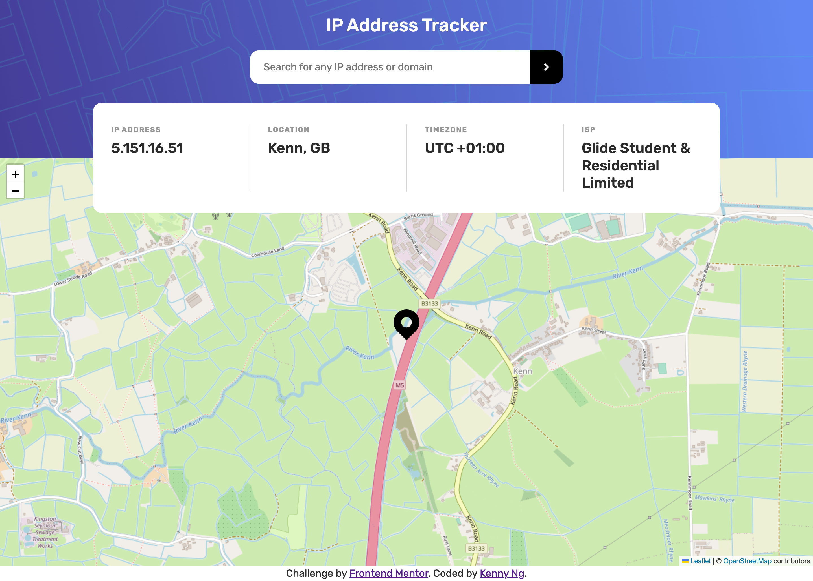
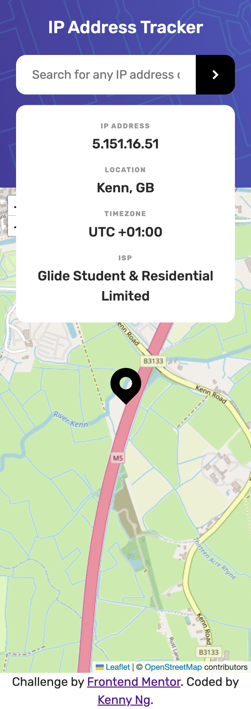

# Frontend Mentor - IP address tracker solution

This is a solution to the [IP address tracker challenge on Frontend Mentor](https://www.frontendmentor.io/challenges/ip-address-tracker-I8-0yYAH0). Frontend Mentor challenges help you improve your coding skills by building realistic projects.

## Table of contents

- [Overview](#overview)
  - [The challenge](#the-challenge)
  - [Screenshot](#screenshot)
- [My process](#my-process)
  - [Built with](#built-with)
  - [What I learned](#what-i-learned)
  - [Useful resources](#useful-resources)
- [Author](#author)

## Overview

### The challenge

Users should be able to:

- View the optimal layout for each page depending on their device's screen size
- See hover states for all interactive elements on the page
- See their own IP address on the map on the initial page load
- Search for any IP addresses or domains and see the key information and location

### Screenshot

<p>Desktop version</p>

<p>Mobile version</p>

### Links

- Solution URL: [https://www.frontendmentor.io/solutions/-nextjs-responsive-ip-address-tracker-using-grid-and-flex-box-TYWvCL7kMl](https://www.frontendmentor.io/solutions/-nextjs-responsive-ip-address-tracker-using-grid-and-flex-box-TYWvCL7kMl)
- Live Site URL: [https://fm-ip-address-tracker-kennylun123.vercel.app/](https://fm-ip-address-tracker-kennylun123.vercel.app/)

## My process

Prerequisite:

1. Install npm packages: react-leaflet, leaflet
2. Create Map component
3. Disable ssr for Map component using "next/dynamic" // **important **

General Steps:

1.  User enter a domain / ip adress
2.  When the button is clicked, validate input is ip adress or domain
3.  When submit button is pressed, collect input value in useState hook
4.  Make an internal POST request to /api/ipify with useEffect hook, listening to the update of user input data
5.  Make a GET request to external API
6.  Response to client side
7.  Update the data state and UI

### Built with

- Semantic HTML5 markup
- CSS custom properties
- Flexbox
- CSS Grid
- Mobile-first workflow
- [React](https://reactjs.org/) - JS library
- [Next.js](https://nextjs.org/) - React framework
- CUBE CSS

### What I learned

This is my first project using NextJS and handling external API calls,

- Components structure of NextJS
- API Route of NextJS
- Masking an API Key
- .env
- Server Side Rendering
- Leaflet and react-leaflet
- Statement testing using `regular expression`

```javascript
const validateInput = (input) => {
  // No API call is executed if same input
  if (input.value === inputValue.value) {
    return;
  }
  // Regular expressions for IP address and domain
  var ipAddressRegex = /^((25[0-5]|(2[0-4]|1\d|[1-9]|)\d)\.?\b){4}$/;
  var domainRegex =
    /^[a-zA-Z][a-zA-Z0-9-]*?(\.[a-zA-Z0-9-]+)*(\.[a-zA-Z]{2,})$/;

  if (ipAddressRegex.test(input.value)) {
    setInputValue({
      type: "ipAddress",
      value: input.value,
    });
    input.value = "";
  } else if (domainRegex.test(input.value)) {
    setInputValue({
      type: "domain",
      value: input.value,
    });
    input.value = "";
  } else {
    return alert("Please enter a valid IP address or URL");
  }
};
```

Here is the findings that I should pay attention on further NextJS projects,

- useEffect run twice in first render since restrict mode is on. (It doesn't on production but only on dev run)
- Some library might making `window is not define` error as they might not support server side rendering

### Useful resources

- [Leaflet](https://leafletjs.com/examples/quick-start/) - Beginner tutorial of an open-source JavaScript library
  for mobile-friendly interactive maps
- [React-leaflet](https://react-leaflet.js.org/) - React component for leafet
- [Ipify api](https://www.ipify.org/) - A Simple Public IP Address API
- [Handling sensitive client-side API keys in Next](https://codegino.com/blog/next-hide-api-key) - This is the blog of masking API keys

## Author

- Website - [Kenny Ng](https://www.github.com/kennylun123)
- Frontend Mentor - [@Kenny Ng](https://www.frontendmentor.io/profile/kennylun123)
